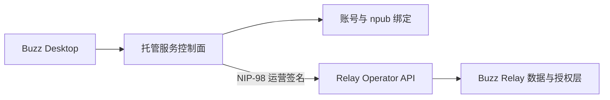

# Nostr 在 Buzz 中的作用

本文说明 Nostr、Buzz 和 Relay 之间的关系，以及 Nostr 身份和签名如何进入
Buzz 的普通数据流与运营管理流。

## 一句话结论

Buzz 是产品和业务实现，Nostr 是客户端与 Relay 交换签名事件的协议，Relay
是验证、保存、查询和转发这些事件的服务端。

```text
Buzz 客户端  --Nostr Event/WebSocket-->  Buzz Relay  -->  Postgres/Redis/S3
```

Nostr 不是区块链，也不要求使用某种加密货币。它的核心是公私钥身份、签名
事件和 Relay 通信模型。

## Nostr 的基本模型

每个 Nostr 用户拥有一对基于 `secp256k1` 的密钥：

- 公钥是可公开的身份标识。
- 私钥用于对事件和请求签名，必须保密。
- `npub` 是公钥的 NIP-19 人类可读编码。
- `nsec` 是私钥的 NIP-19 人类可读编码。

拿到某个用户的私钥，通常就具备了以该用户身份签名的能力。因此，`nsec`
不能进入日志、截图、提交记录或服务端明文配置。

Nostr 在线路上的核心数据结构是 `event`。一个事件通常包含：

```json
{
  "id": "事件内容的哈希",
  "pubkey": "作者公钥",
  "created_at": 1710000000,
  "kind": 1,
  "tags": [],
  "content": "事件内容",
  "sig": "作者签名"
}
```

其中：

- `kind` 决定客户端应该如何解释事件。
- `tags` 表达事件、用户、频道等关系，并可供 Relay 索引和过滤。
- `sig` 证明事件由对应私钥持有者签发。
- `id` 绑定事件的实际内容，内容被修改后原签名将不再有效。

客户端通常通过 WebSocket 与 Relay 通信：

- `EVENT` 发布事件。
- `REQ` 创建查询或实时订阅。
- `CLOSE` 关闭订阅。

基础格式和通信流程由
[NIP-01](https://github.com/nostr-protocol/nips/blob/master/01.md) 定义，`npub`、
`nsec` 等编码由
[NIP-19](https://github.com/nostr-protocol/nips/blob/master/19.md) 定义。

## Buzz 如何使用 Nostr

Buzz 采用 Nostr-first 的接口设计。主要业务操作优先表示为 Nostr 事件，并通过
WebSocket 发布、查询和订阅，而不是为每项业务单独增加一个 JSON HTTP API。

在 Buzz 中可以这样理解各层职责：

| 层 | 主要职责 |
| --- | --- |
| Buzz 客户端 | UI、编辑事件、本地持有身份密钥、签名、发布和订阅 |
| Nostr/NIP | 事件格式、身份签名、查询和通信规则 |
| Buzz Relay | 签名验证、认证授权、Community/Channel 隔离、持久化和实时分发 |
| Postgres/Redis/S3 | 事件与控制状态、跨实例实时广播、媒体与对象存储 |

Buzz 并不是一个只会转发公共事件的通用 Relay。它在 Nostr 事件模型上增加了
Community、Channel、成员角色、工作流、媒体、Git 和 Agent 等产品能力，并在
服务端执行对应的授权与租户隔离。

### Community 和 Channel

Buzz 的 Community 是租户和安全边界。Relay 根据请求的域名解析
`community_id`，而不是相信客户端自行声明的 Community。

Channel 使用 NIP-29 风格的 `h` tag 表达作用域。可以把两级关系简化为：

```text
请求 Host  -->  community_id  -->  h tag/channel_id  -->  消息与成员关系
```

因此，Nostr 公钥回答“是谁签发了事件”，而 Relay 的 Community/Channel
授权回答“这个身份是否有权在这里执行该操作”。拥有一把有效私钥不等于自动
拥有所有 Community 的访问权限。

更多租户隔离细节见 [Multi-Tenant Buzz Relay](multi-tenant-relay.md)。

## 身份认证与运营管理

Buzz 中存在两类容易混淆的签名流。

### 用户数据流

普通用户使用自己的 Nostr 私钥签署消息、频道操作和其他事件。Relay 验证
签名，再结合 Community 成员关系和事件类型决定是否接收。

WebSocket 连接认证使用 Nostr challenge/response 模式；成功认证只证明客户端
控制对应私钥，后续仍需通过 Community 和 Channel 授权。

### Relay 运营流

Community 创建、归档、恢复和所有权转移属于部署级操作，不能只依赖某个尚未
创建的 Community 内部角色。Buzz 因此提供独立的 Operator HTTP API，例如：

```text
POST /operator/communities
GET  /operator/communities
GET  /operator/communities/availability
POST /operator/communities/archive
POST /operator/communities/unarchive
POST /operator/communities/transfer
```

这些 HTTP 请求通过
[NIP-98](https://github.com/nostr-protocol/nips/blob/master/98.md) 进行 Nostr
签名，并且签名公钥必须位于部署配置的 `RELAY_OPERATOR_PUBKEYS` allowlist 中。
NIP-98 将请求方法、URL，并在需要时将请求体哈希绑定到签名，防止请求被替换或
重放。

相关实现位于：

- [`crates/buzz-relay/src/api/operator.rs`](../crates/buzz-relay/src/api/operator.rs)
- [`crates/buzz-relay/src/handlers/community_provisioning.rs`](../crates/buzz-relay/src/handlers/community_provisioning.rs)

一个托管服务的典型调用链如下：



托管服务中的邮箱、OIDC 或企业账号不是 Nostr 身份本身。控制面需要保存账号与
`npub` 的映射，并通过一次由该 Nostr 私钥签名的 challenge 验证用户确实控制
这个 `npub`。

## 二次开发时的边界

二次开发 Buzz 时，不需要重新设计 Nostr 协议。需要明确处理的是以下边界：

1. 客户端在哪里生成和保存私钥。
2. 账号体系如何与 `npub` 建立经过签名验证的一对一或多对一映射。
3. Relay 如何根据 Host 解析 Community，并执行成员和 Channel 授权。
4. 控制面如何安全保存 Operator 私钥并签署 NIP-98 请求。
5. 日志、遥测、错误上报和备份如何避免泄露 `nsec` 或 Operator 私钥。

官方托管控制面不是 Nostr 的必要组成部分。自建部署可以使用自己的账号系统和
控制面，只要它能够：

- 验证用户对 Nostr 公钥的控制权；
- 安全调用 Relay Operator API；
- 维护账号、`npub`、Community 和域名之间的映射；
- 不把 Operator 私钥下发给普通客户端。

## 常见误解

- **Nostr 不是 Buzz 的数据库。** 数据由 Relay 的存储实现保存。
- **Relay 不是 Nostr 协议本身。** Relay 是实现该协议的服务端。
- **`npub` 不是秘密。** 它是公开身份；`nsec` 才必须保密。
- **签名不等于授权。** 签名证明“是谁”，成员和租户规则决定“能做什么”。
- **Builderlab 账号不等于 Nostr 身份。** 两者需要通过签名 challenge 建立绑定。
- **自建控制面不必使用官方内部技术栈。** 只需遵守客户端与 Relay 两侧的接口和安全边界。

